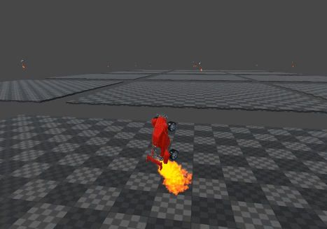

# RoboLeague ML/RL Experiments

Unity ML-Agents experiments for vehicle control, hovering, and aerial ball handling. The soccer-pitch gameplay scene and stadium assets have been removed; only ML/RL experiment scenes remain.

## Setup

Open with Unity 2020.1.17f1. This project uses [ML-Agents Release 11](https://github.com/Unity-Technologies/ml-agents/releases/tag/release_11); refer to its installation instructions for training setup.

## Scenes

- `Assets/Scenes/SimpleMLTest.unity` — basic ML test environment.
- `Assets/ML-Agents/Experiments/CalmHover/CalmHover.unity` — hovering.
- `Assets/ML-Agents/Experiments/AirDribble/AirDribble.unity` — aerial ball handling; default enabled build scene.
- `Assets/ML-Agents/Experiments/MaxSpeedPlusConstantRoll/MaxSpeedPlusRoll.unity` — speed and constant roll.

Training configurations and trained ONNX models remain under `Assets/ML-Agents`. Shared vehicles, balls, controllers, and training surfaces remain available for the experiments.

## Preview

## Licence

[Attribution-NonCommercial 4.0 International (CC BY-NC 4.0)](https://creativecommons.org/licenses/by-nc/4.0/)
